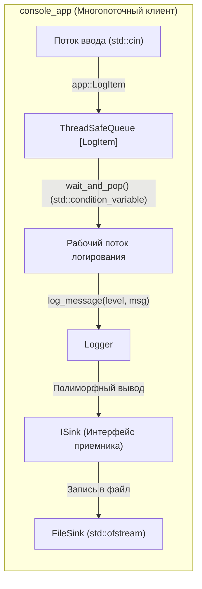

# Тестовое задание от ИнфоТеКС на стажировку Разработчик C/С++
[](https://en.cppreference.com/w/cpp/17)
[](Makefile)
[](https://ubuntu.com)
[](#архитектурные-принципы)

# [Ссылка на github](https://github.com/kex1tu/test_infotecs.DeveloperC_Cpp)

Вся разработка велась в репозитории для тестового задания Разработчк С++, основная часть кода взята оттуда.
Ссылка на репозиторий c историей разработки https://github.com/kex1tu/test_infotecs.DeveloperCpp


Модульный программный комплекс на C++17, включающий в себя потокобезопасную библиотеку многоуровневого логирования в файл, консольное многопоточное приложение-клиент с потокобезопасной блокирующей очередью.

---

## Архитектура системы



---

## Архитектурные принципы и инварианты

1. **Стандарт C++17 и Pure STL**: проект не использует внешних сторонних библиотек. Вся логика построена исключительно на стандартной библиотеке C++17 и POSIX-потоках.
2. **Парадигма Zero-Exceptions**: бизнес-логика не использует `throw`. Все ошибки возвращаются через детерминированные коды возврата (`LoggerError`, `std::optional`). В местах работы с STL I/O используются защитные `try-catch` блоки.
3. **Потокобезопасность (Thread Safety)**: передача логов между потоком ввода и потоком записи в `console_app` изолирована через шаблонную очередь `ThreadSafeQueue` с использованием `std::mutex` и `std::condition_variable`.
4. **Принцип открытости/закрытости (OCP / Strategy Pattern)**: расширение способов вывода логов достигается реализацией интерфейса `ISink` (`FileSink`) без модификации класса `Logger`.
5. **Memory Safety & RAII**: управление ресурсами основано на семантике перемещения и умных указателях (`std::unique_ptr`). Утечки памяти отсутствуют (проверено в `valgrind`).

---

## Структура репозитория

```text
.
├── Makefile                        # корневой Makefile сборки всех компонентов
├── README.md                       # документация проекта
├── .clang-format                   # правила форматирования кода
├── .clang-tidy                     # конфигурация статического анализатора
│
├── logger/                         # ЧАСТЬ 1: библиотека логирования
│   ├── Makefile                    # сборка liblogger.so
│   ├── include/
│   │   ├── isink.hpp               # интерфейс приемника сообщений
│   │   ├── file_sink.hpp           # реализация записи в текстовый файл
│   │   ├── log_level.hpp           # уровни важности (DEBUG, INFO, WARNING, ERROR)
│   │   ├── logger.hpp              # основной класс управления логированием
│   │   ├── logger_factories.hpp    # фабричные методы создания логгеров
│   │   ├── logger_error.hpp        # типизированные коды ошибок
│   │   └── thread_safe_queue.hpp   # потокобезопасная блокирующая очередь
│   └── src/
│       ├── file_sink.cpp
│       └── logger.cpp
│
├── console_app/                    # ЧАСТЬ 2: клиентское многопоточное приложение
│   ├── Makefile                    # сборка исполняемого файла console_app
│   └── src/
│       ├── main.cpp                # точка входа, организация потоков
│       ├── utilities.hpp           # парсинг пользовательского ввода и CLI-аргументов
│       └── utilities.cpp
│
├── tests/                          # модульные и интеграционные тесты
│   ├── Makefile                    # сборка и запуск тестов
│   ├── tests.hpp                   # минималистичный безысключительный assert-фреймворк
│   ├── test_logger.cpp             # тестирование ядра логгера и уровней фильтрации
│   ├── test_thread_safe_queue.cpp  # тестирование очереди задач
│   └── test_utilities.cpp          # тестирование парсинга аргументов и ввода
│
└── .github/workflows/              # CI/CD пайплайны сборки и тестирования
    └── make-single-platform.yml

```

---

## Требования к окружению

Для сборки и запуска потребуется Linux-окружение (Ubuntu 20.04/22.04 LTS или Debian 11/12):

```bash
# базовые инструменты сборки (компилятор GCC/G++ и GNU Make)
sudo apt-get update
sudo apt-get install -y build-essential

# инструменты статического анализа, форматирования и профилирования (рекомендуется)
sudo apt-get install -y clang-format clang-tidy valgrind

```

---

## Сборка проекта

```bash
make clean && make -j$(nproc)
```


```bash
# Сборка отдельных компонентов:
make logger       # сборка библиотеки logger/liblogger.so
make console_app  # сборка клиента console_app/console_app
make tests        # сборка тестов
```


---

## Запуск и использование

### 1. Демонстрационный сценарий
```bash
# --- Запуск клиента ---
# Использование: ./console_app/console_app <filepath> [DEBUG|INFO|WARNING|ERROR]
./console_app/console_app app.log INFO
```
```bash
# --- Ввод логов в консоль ---
[DEBUG] Application started
[INFO] Application launched successfully
[WARNING] High memory usage detected (85%)
[ERROR] Database connection lost: timeout
exit
```
В файле app.log отобразятся логи с уровнем INFO и выше (т.к. был передан уровень INFO). 

---

### 2. Справочник параметров CLI

#### Клиент логирования (`console_app`)
```bash
# логирование в локальный файл:
./console_app/console_app <filepath> [DEFAULT_LEVEL]
```
- `[DEFAULT_LEVEL]` *(опционально)*: `DEBUG`, `INFO` *(по умолчанию)*, `WARNING`, `ERROR`.
- Для завершения работы введите в консоль команду `exit`.

---

## Тестирование

### Запуск всех тестов

```bash
make test
```

### Запуск модулей тестирования напрямую
```bash
./tests/test_logger
./tests/test_thread_safe_queue
./tests/test_utilities
```

### Анализ памяти и санитайзеры (ASan, UBSan, TSan, Valgrind)

Сборка и запуск полного набора тестов с **AddressSanitizer** и **UndefinedBehaviorSanitizer**:
```bash
make asan
```

Сборка и запуск полного набора тестов с **ThreadSanitizer**:
```bash
make tsan
```

Анализ памяти через **Valgrind Memcheck**:
```bash
valgrind --leak-check=full --show-leak-kinds=all --error-exitcode=1 ./tests/test_logger
valgrind --leak-check=full --show-leak-kinds=all --error-exitcode=1 ./tests/test_thread_safe_queue
valgrind --leak-check=full --show-leak-kinds=all --error-exitcode=1 ./tests/test_utilities
```

---

## Соответствие требованиям технического задания

| Пункт ТЗ | Требование | Статус | Компонент реализации |
| :--- | :--- | :---: | :--- |
| **1.1** | Библиотека должна быть динамической | Да | [logger/Makefile](logger/Makefile) (`liblogger.so`) |
| **1.2** | Параметры инициализации: имя файла, уровень по умолчанию ($\ge 3$) | Да | [logger.hpp](logger/include/logger.hpp), [log_level.hpp](logger/include/log_level.hpp) |
| **1.3** | Формат записи в журнале: текст, уровень важности, время | Да | [logger.cpp](logger/src/logger.cpp) |
| **1.4** | Смена уровня важности сообщений по умолчанию после инициализации | Да | [Logger::set_level()](logger/include/logger.hpp) |
| **2.1.a** | Подключение и использование библиотеки логирования | Да | [console_app/src/main.cpp](console_app/src/main.cpp) |
| **2.1.b** | Прием сообщения и уровня важности в консоли (уровень опционален) | Да | [utilities.cpp](console_app/src/utilities.cpp) (`parse_input`) |
| **2.1.c** | Потокобезопасная передача данных в отдельный поток записи | Да | [thread_safe_queue.hpp](logger/include/thread_safe_queue.hpp) |
| **2.1.d** | Ожидание нового ввода от пользователя | Да | [console_app/src/main.cpp](console_app/src/main.cpp) |
| **2.2** | Параметры CLI приложения: имя файла и уровень по умолчанию | Да | [utilities.cpp](console_app/src/utilities.cpp) (`parse_cli_args`) |
| **Общие** | C++17, Makefile, GCC, цель clean, pure STL, без сторонних библиотек | Да | [Makefile](Makefile), [tests/Makefile](tests/Makefile) |

<details>
<summary><b>Развернуть официальный текст технического задания</b></summary>
---

# Тестовое задание C++ -- многопоточная реализация записи сообщений в журнал

### Цель
Разработать библиотеку для записи сообщений в журнал с разными уровнями важности и приложение, демонстрирующее работу библиотеки.

---

### Часть 1.
Разработать библиотеку для записи текстовых сообщений в журнал. В качестве журнала использовать текстовый файл.

#### Требования к разрабатываемой библиотеке
1. Библиотека должна быть динамической.
2. Библиотека при инициализации должна принимать следующие параметры:
   - **a.** Имя файла журнала.
   - **b.** Уровень важности сообщения по умолчанию. Сообщения с уровнем ниже заданного не должны записываться в журнал. Уровень рекомендуется задавать с помощью перечисления с понятными именами. Достаточно трех уровней важности.
3. В журнале должны быть сохранена следующая информация:
   - **a.** Текст сообщения.
   - **b.** Уровень важности.
   - **c.** Время получения сообщения.
4. После инициализации должна быть возможность менять уровень важности сообщений по умолчанию.

---

### Часть 2.
Разработать консольное многопоточное приложение для проверки библиотеки записи сообщений в журнал.

#### Требования к приложению
1. Приложение должно:
   - **a.** Подключать и использовать библиотеку, реализованную в Части 1, для записи сообщений в журнал.
   - **b.** В консоли принимать сообщение и уровень важности этого сообщения от пользователя. Уровень важности может отсутствовать.
   - **c.** Передавать принятые данные от пользователя в отдельный поток для записи в журнал. Передача данных должна быть потокобезопасной.
   - **d.** Ожидать нового ввода от пользователя после передачи данных.
2. Параметрами приложения должны быть имя файла журнала и уровень важности сообщения по умолчанию.
3. Внутреннюю логику приложения придумать самостоятельно.

---

### Требования к выполнению задания
- Программный код должен быть написан на языке C++ с использованием стандарта C++17. Следует придерживаться подходов ООП к разработке.
- Сборку проекта и запуск тестов оформить в Makefile. Для компиляции использовать компилятор gcc. Цели сборки библиотеки и тестового приложения должны быть разделены. Кроме того, должна быть задана цель clean для очистки каталога от временных файлов.
- В папке с исходным кодом не должно быть мусора: неиспользуемых файлов исходных кодов или ресурсов, промежуточных файлов сборки и т.д.
- Не использовать никаких сторонних библиотек помимо stl.
- В качестве целевой операционной системы, на которой будет проверяться тестовое задание, стоит рассматривать актуальные версии ubuntu/debian.
- Приложение должно корректно обрабатывать ошибки, связанные с записью в файлы.
- Все файлы (исходный код библиотеки и приложения, Makefile) должны быть размещены в одном git-репозитории.

---

### Оценка выполнения задания
Кандидат должен предоставить ссылку на git-репозиторий с выполненным заданием. Оценка будет проводиться на основе следующих критериев:
1. Качество и читаемость кода приложения на C++.
2. Корректность работы приложения с различными входными данными.
3. Наличие и качество документации к выполненному заданию (README-файл, комментарии в коде и т.д.).
</details>
